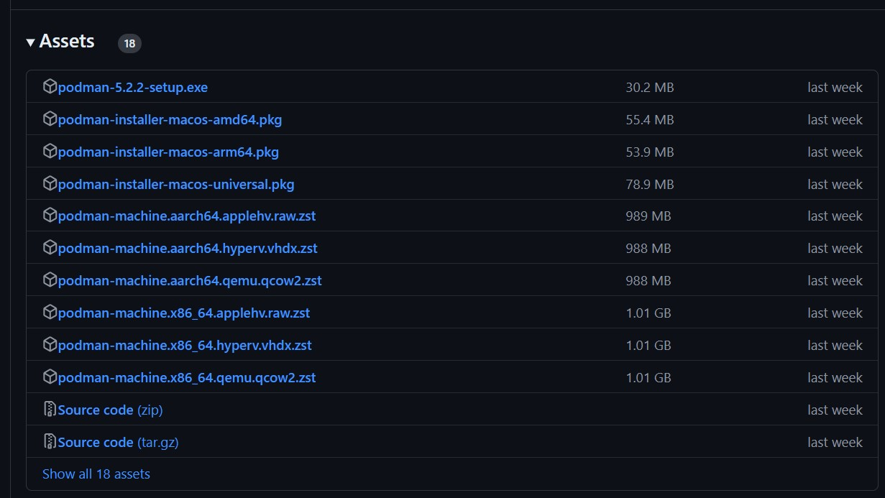
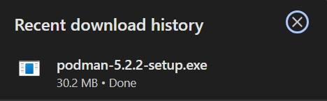
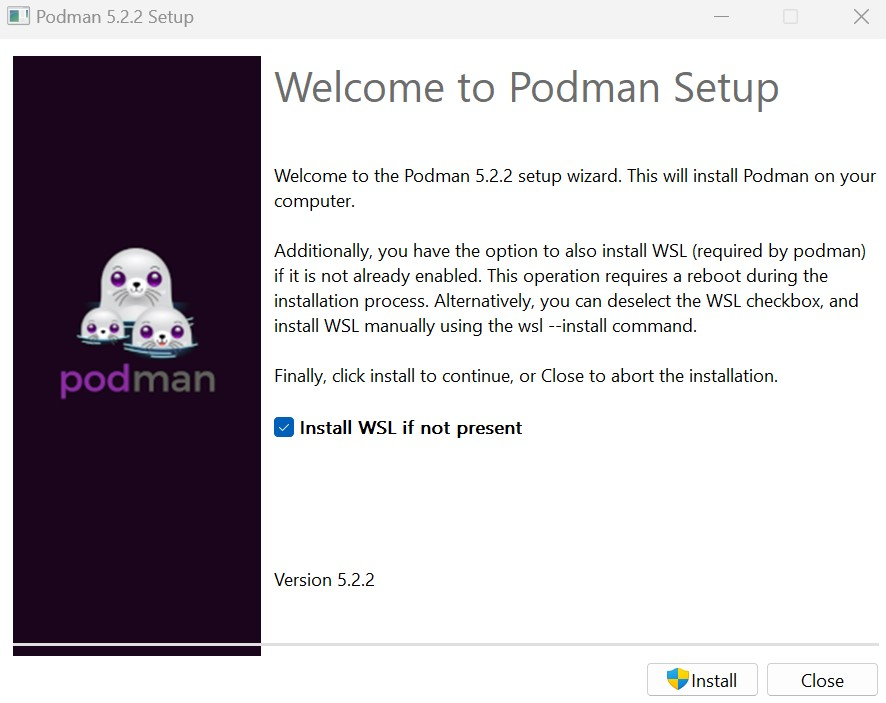

### Section #1 - Apa itu Podman?
Podman adalah tools asli dari Linux yang bersifat open source dan daemonless yang dirancang untuk memudahkan pencarian, menjalankan, membangun, sharing, dan distribusi aplikasi menggunakan Open Containers Initiative (OCI). Podman menyediakan command line interface (CLI) yang familiar bagi siapa saja yang pernah menggunakan Docker Container Engine. Sebagian besar pengguna dapat mengubah dari docker menjadi podman tanpa masalah yang berarti. Mirip dengan Container Engine umum lainnya (Docker, CRI-O, containerd), Podman mengandalkan Container Runtime yang sesuai dengan OCI (runc, crun, runv, dll.) untuk berinteraksi dengan sistem operasi dan membuat container yang berjalan. Hal ini membuat container yang berjalan yang dibuat oleh Podman hampir tidak dapat dibedakan dari yang dibuat oleh mesin container umum lainnya.

### Section #2 - Instalasi Podman pada Windows
1. Download Podman Windows installer






Setelah download podman, podman.exe akan tersimpan di PATH, dan kita akan dapat menjalankan perintah podman machine init untuk membuat machine pertama kita.

#### Step 2.1 - Instalasi WSL Otomatis
Jika WSL belum terinstal di komputer, command machine init pertama akan muncul dialog proses untuk memulai penginstalan otomatis. Jika setuju, maka proses ini akan menginstal komponen Windows yang diperlukan, restart sistem, dan setelah login kembali akan menampilkan kembali proses pembuatan mesin di terminal. Pastikan untuk menunggu satu atau dua menit hingga launch ulang terjadi, karena Windows mengalami penundaan sebelum menjalankan item startup. Atau, kita dapat menolak penginstalan otomatis dan menginstal WSL secara manual.

#### Step 2.2 - Proses Inisialisasi Mesin
1. Setelah WSL terinstal, perintah init akan melakukan instalasi Fedora, melakukan penyesuaian untuk menjalankan podman.
```
PS C:\Users\Riyan> podman machine init
Extracting compressed file
Importing operating system into WSL (this may take 5+ minutes on a new WSL install)...
Installing packages (this will take a while)...
Complete!
Configuring system...
Generating public/private ed25519 key pair.
Your identification has been saved in podman-test-riyan
Your public key has been saved in podman-test-riyan.pub
The key fingerprint is:
SHA256:RGTGg2Q/LX7ijN+mzu8+BzcS3cEWP6Hir6pYllJtceA root@WINPC
Machine init complete
To start your machine run:

        podman machine start
```

#### Step 2.3 - Menjalankan Machine
1. Setelah proses inisialisasi mesin selesai, mesin dapat mulai dijalankan dan dihentikan sesuai keinginan:
```
PS C:\Users\Riyan> podman machine start

Starting machine "podman-test-riyan"

This machine is currently configured in rootless mode. If your containers
require root permissions (e.g. ports < 1024), or if you run into compatibility
issues with non-podman clients, you can switch using the following command:

        podman machine set --rootful

API forwarding listening on: npipe:////./pipe/docker_engine

Docker API clients default to this address. You do not need to set DOCKER_HOST.
Machine "podman-test-riyan" started successfully
```

#### Step 2.4 - Menjalankan Perintah Pertama pada Podman
1. Pada proses ini, perintah pada podman hampir serupa dengan perintah-perintah yang ada pada Linux. 
Untuk contoh command sederhana yang ada pada podman, kita dapat menjalankan perintah Linux date di PowerShell.
```
PS C:\Users\Riyan> podman run ubi8-micro date
Thu May 5 21:56:42 UTC 2022
```

#### Step 2.5 - Menampilkan Daftar Machine Podman
1. Untuk menampilkan daftar mesin podman yang tersedia dan penggunaan resources, dapat menggunakan perintah `podman machine ls`:
```
PS C:\Users\Riyan> podman machine ls


NAME                    VM TYPE     CREATED      LAST UP            CPUS        MEMORY      DISK SIZE
podman-test-riyan        wsl       1 hours ago  Currently running   4           200.1MB     570MB
```

#### Step 2.6 - Menghentikan Mesin Podman
1. Untuk menghentikan mesin podman yang sedang berjalan, gunakan perintah berikut:
```
PS C:\Users\Riyan> podman machine stop
Machine "podman-test-riyan" stopped successfully
```

#### Step 2.7 - Menghapus Mesin Podman
1. Untuk menghapus mesin, gunakan perintah `podman machine rm`: 
```
PS C:\Users\User> podman machine rm

The following files will be deleted:

C:\Users\User\.ssh\podman-test-riyan
C:\Users\User\.ssh\podman-test-riyan.pub
C:\Users\User\.local\share\containers\podman\machine\wsl\podman-test-riyan_fedora-35-x86_64.tar
C:\Users\User\.config\containers\podman\machine\wsl\podman-test-riyan.json
C:\Users\User\.local\share\containers\podman\machine\wsl\wsldist\podman-test-riyan


Are you sure you want to continue? [y/N] y
```
